基于SpringBoot的毕业论文管理系统（程序+论文）
=
- 完整代码获取地址：从戎源码网 ([https://armycodes.com/](https://armycodes.com/))
- 作者微信：19941326836  QQ：952045282 
- 承接计算机毕业设计、Java毕业设计、Python毕业设计、深度学习、机器学习
- 选题+开题报告+任务书+程序定制+安装调试+论文+答辩ppt 一条龙服务
- 所有选题地址https://github.com/nature924/allProject

一、项目介绍
---
基于Spring Boot框架实现的毕业论文管理系统，系统包含四种角色：管理员、评阅教师、指导教师、用户,系统分为前台和后台两大模块，主要功能如下。
### 前台：
- 用户：
  - 个人中心：管理个人信息。
  - 课题信息管理：查看和管理已选课题的信息。
  - 选题申请管理：申请选择毕业论文的课题。
  - 课题任务管理：查看和管理所选课题的任务进度。
  - 毕业论文管理：上传、修改和查看自己的毕业论文。
  - 公告信息管理：查看系统发布的公告信息。
  - 评阅教师管理：查看和选择评阅自己毕业论文的教师。
  - 用户管理：管理自己的账户信息。

### 后台：
- 评阅教师：
  - 个人中心：管理个人信息。
  - 毕业论文管理：查看和评阅指派给自己的毕业论文。
  - 公告信息管理：发布和管理公告信息。
  - 用户管理：管理用户的信息和权限。
  - 指导老师管理：管理指导学生的教师信息。

- 指导教师：
  - 个人中心：管理个人信息。
  - 课题信息管理：创建、修改和管理课题信息。
  - 选题申请管理：审批和管理学生的选题申请。
  - 课题任务管理：发布、修改和管理课题的任务进度。
  - 毕业论文管理：查看和评阅指导的学生的毕业论文。
  - 公告信息管理：发布和管理公告信息。
  - 用户管理：管理用户的信息和权限。

- 管理员：
  - 个人中心：管理个人信息。
  - 管理员管理：管理管理员的信息和权限。
  - 毕业论文管理：查看、审核和管理所有学生上传的毕业论文。
  - 课题信息管理：创建、修改和管理课题信息。
  - 选题申请管理：审批和管理学生的选题申请。
  - 课题任务管理：发布、修改和管理课题的任务进度。
  - 基础数据管理：管理系统的基础数据。
  - 公告信息管理：发布和管理公告信息。
  - 评阅教师管理：管理评阅学生毕业论文的教师信息。
  - 用户管理：管理用户的信息和权限。
  - 指导教师管理：管理指导学生的教师信息。

二、项目技术
---
- 编程语言：Java
- 数据库：MySQL
- 项目管理工具：Maven
- 前端技术：VUE、HTML、Jquery、Bootstrap
- 后端技术：Spring、SpringMVC、MyBatis

三、运行环境
---
- 操作系统：Windows、macOS都可以
- JDK版本：JDK1.8以上都可以
- 开发工具：IDEA、Ecplise、Myecplise都可以
- 数据库: MySQL5.7以上都可以
- Tomcat：任意版本都可以
- Maven：任意版本都可以

四、运行截图
---
### 论文截图：
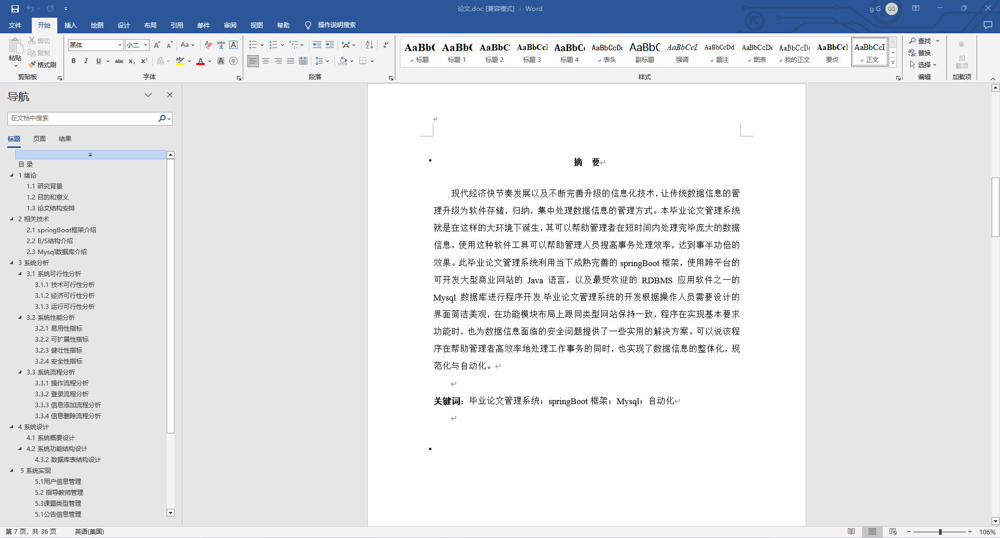
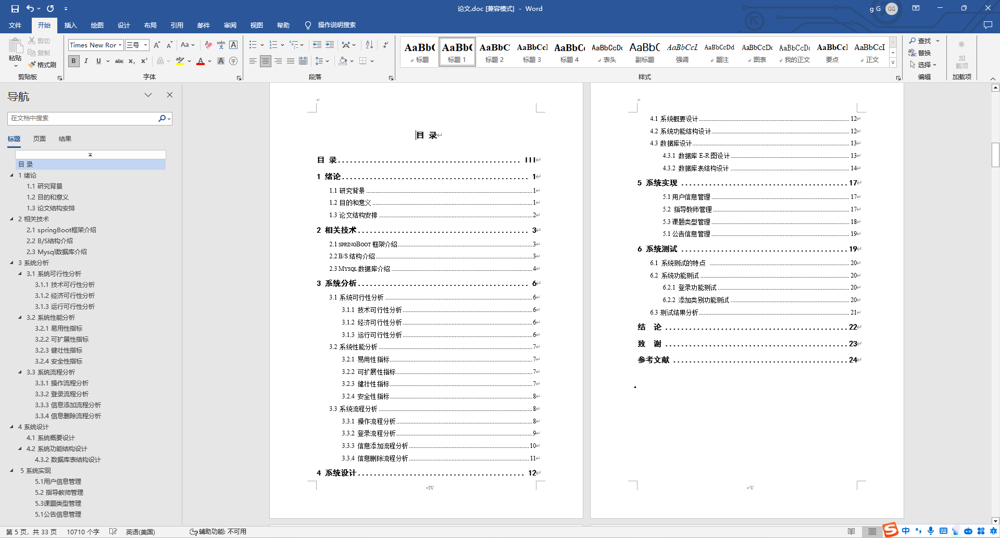

### 程序截图：
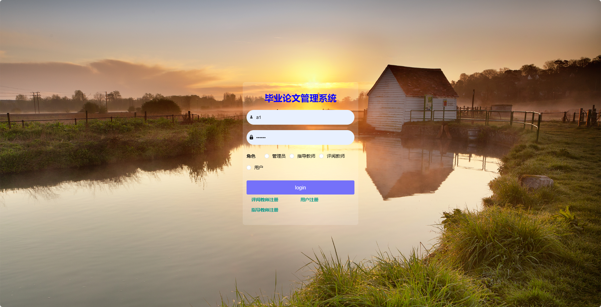
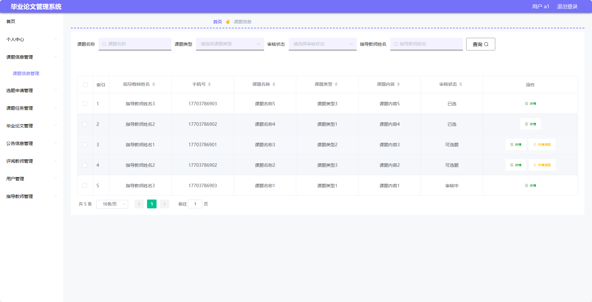
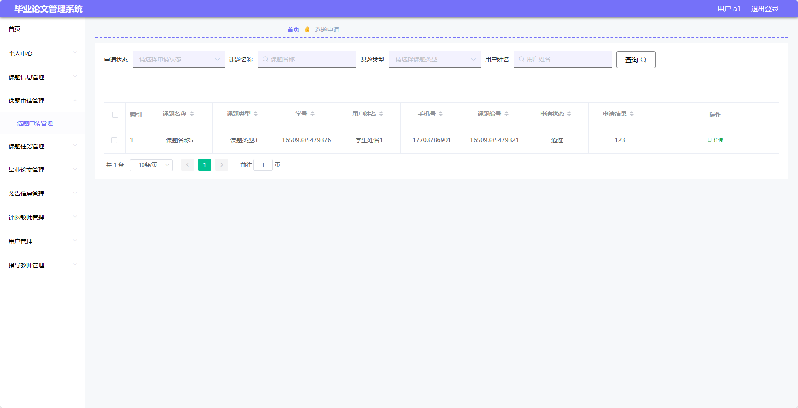

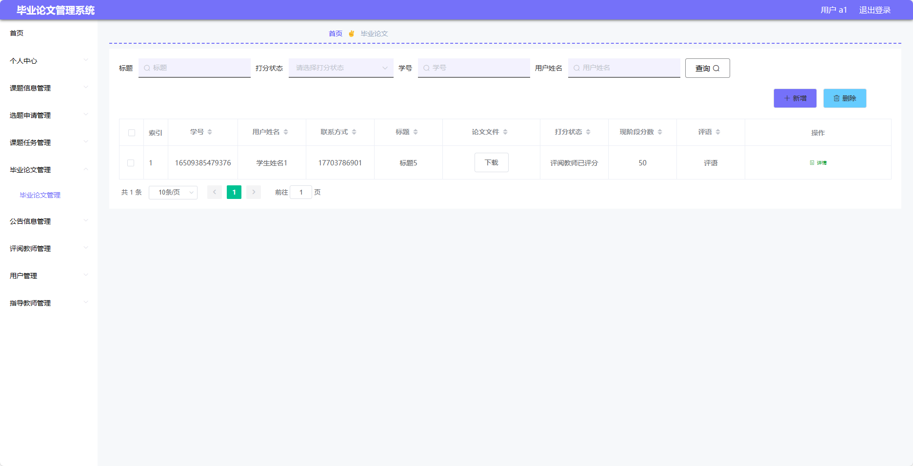
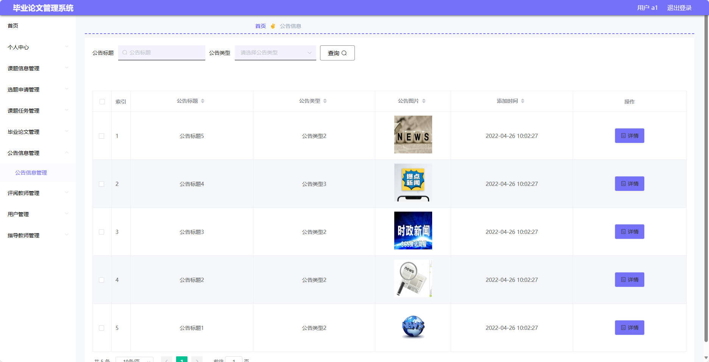
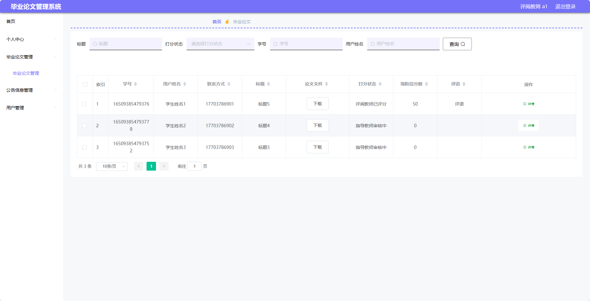
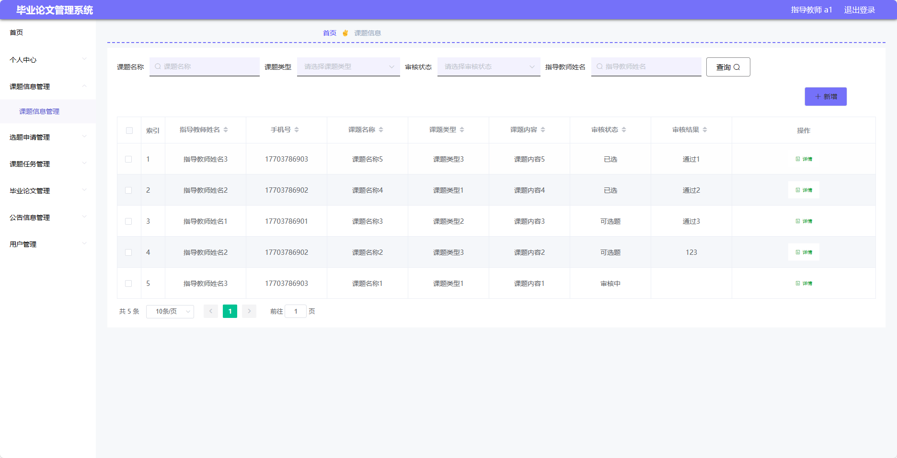
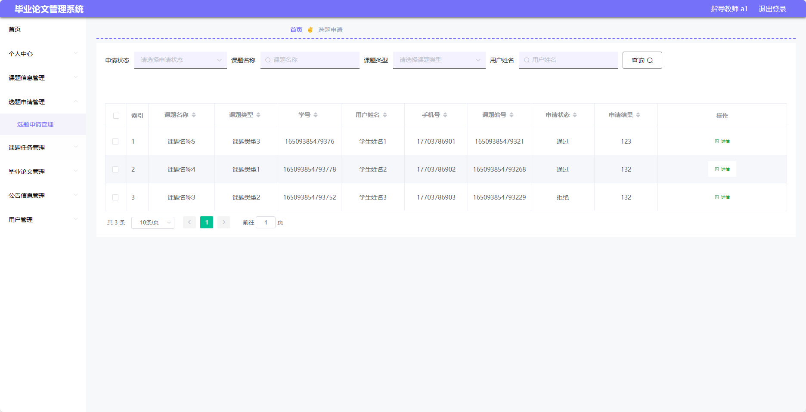
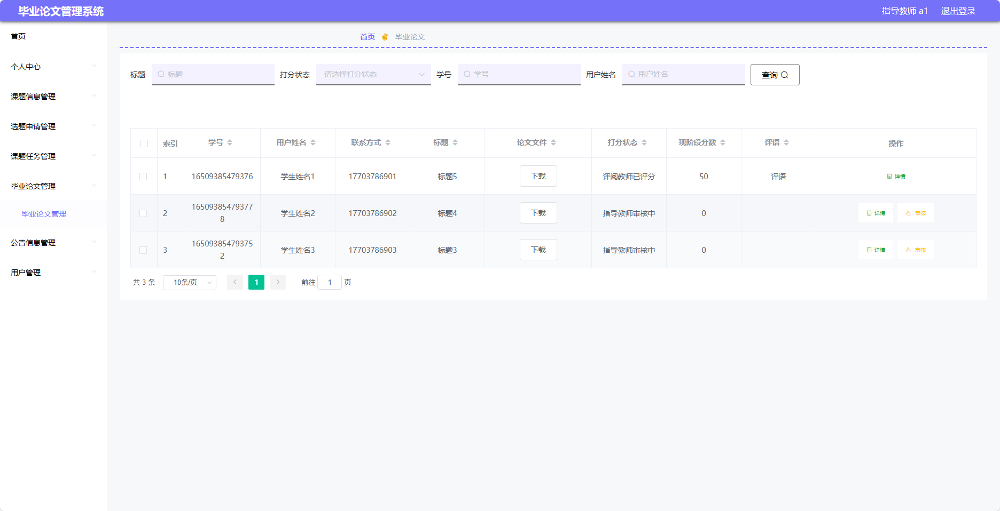

